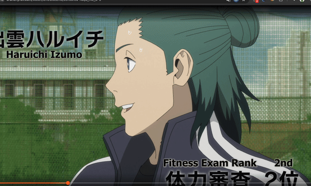

# Crunchyroll Dual Sub
  

> [!IMPORTANT]
> The Firefox distribution of this extension is _extremely_ outdated due to long review time on Firefox's end. Sorry about that. 

Web extension created to fix the annoying issue of not being able to use `English` and `English [CC]` subtitles at the same time[^1]. The extension works best on shows like Frieren: Beyond Journey's End where there are both types of subtitles. This extension supports [Croptix](https://github.com/stratumadev/croptix) and [Improve Crunchyroll](https://github.com/ThomasTavernier/Improve-Crunchyroll).

## Terminologies

| Term                          | Meaning                                                                                                                                                                                                                                                                                                                                  |
|-------------------------------|------------------------------------------------------------------------------------------------------------------------------------------------------------------------------------------------------------------------------------------------------------------------------------------------------------------------------------------|
| Hard-subbing                  | Crunchyroll's default subtitle "rendering" method where they burn the subtitles directly onto the video of the current episode. This method is only done for on-screen translation subtitles.                                                                                                                                            |
| Soft-subbing                  | Contrary to the hard-subbing method, where subtitles are rendered on the fly as you watch the current episode on your device. This is the behavior introduced by this extension and the [Croptix](https://github.com/stratumadev/croptix) extension.                                                                                     |
| Closed-caption (CC) subtitles | Subtitle intended to supplement the viewing experience by providing text for the ongoing dialogues. This kind of subtitles is typically provided in a `.vtt` or `.srt` file format. Crunchyroll distinguishes these by appending `[CC]` at the end of the subtitle name. For example, `English [CC]`.                                    |
| Non-CC subtitles              | Subtitles intended to translate on-screen text, such as signs, that are in the original language. This kind of subtitles typically have so called "typesetting" with elegant font styles. These subtitles are typically delivered in the `.ass` file format. On Crunchyroll, these are subtitles without the `[CC]` appended at the end. |
| Crunchyroll profile data      | Your profile, loaded and stored by the Crunchyroll webpage, includes your preference information for preferred audio and subtitle language.                                                                                                                                                                                              |
| Crunchyroll subtitle data     | This data is loaded by the Crunchyroll player when you begin watching an episode. It includes URL's to the current episode's subtitle files, which this extension downloads and displays for you automatically.                                                                                                                          |

## Features

### Secondary subtitles
When the Crunchyroll watch page is loaded, the extension reads your Crunchyroll profile data for your preferred/selected subtitle language and type. The extension retrieves the episode's subtitle data in the same manner. The alternate subtitle will then be loaded and rendered accordingly by the extension.

### Scoped options

A pop-up/sidebar menu is provided by the extension for scoped preference control. With it, you can apply desired options per season, per episode, or globally. 

In the menu, there are a few things that you can do: 

1. Apply timing offset for the primary subtitles (i.e. the one selected in the Crunchyroll player). 
2. Apply timing offset for the secondary subtitles (which is loaded by this extension). 
3. Apply subtitle masks to "erase"/hide portions of the primary subtitle.

### Subtitle masking

This feature allows you to "erase" portions of non-CC subtitles. This is intended for if, say, the current primary subtitle contains dialogues and is displaying them at the same time as the secondary subtitle's dialogues. 

## Caveats

### Primary subtitles soft-subbing

This extension, by default, soft-subs non-CC primary subtitles (that is, unless Croptix is installed). The reason being both the timing offset and subtitle masking features require the primary subtitles (if it is not CC subtitles) to be rendered locally in order to interact with them. 

### Dev notes

The dev notes feature of this extension loads dev notes from [here (Github Gist)](https://gist.githubusercontent.com/AndyNoob/49166e0f04f6a9863aed242e07bbcfe9/raw/ccef05b3185aaa820145eb48f89714271cf9fa31/cr-dual-subs-dev-notes.json). The purpose of this feature is to inform you of any changes/information regarding the future updates of this extension. 

## Privacy notice
**Everything stays on your computer/browser.** The extension does not communicate with any external servers other than Crunchyroll's services. Your browser may say that this extension "can read and change your data on sites." That is because this extension adds control elements (such as the subtitle reload button) onto the Crunchyroll webpage, and also reads some of the data loaded by the Crunchyroll player in order to process subtitles. 

## Credits
While not completely vibe-coded, this project was made with the help of generative AI (Google Gemini, Claude Sonnet, GPT). Prior to version `0.10.0`, this project used [frazy-parser](https://github.com/ApayRus/frazy-parser) by [ApayRus](https://github.com/ApayRus) to parse subtitle files. As of version `0.10.0`, [ASSJS](https://github.com/weizhenye/ASS) by [weizhenye](https://github.com/weizhenye) is used to render ASS subtitles, and [srt-vtt-parser](https://github.com/plussub/srt-vtt-parser) by [plussub](https://github.com/plussub) is used to parse VTT subtitle files. 

## How to build
1. `npm install`
2. `npm run build`, default browser is firefox, change this behavior by prepending `BROWSER=chrome` to the command
3. Find archive in `dist-zip/` or built files in `dist/`

[^1]: See Reddit posts: [post1](https://www.reddit.com/r/Crunchyroll/comments/1qpmdz0/english_subtitles_vs_english_cc_not_translating/), [post2](https://www.reddit.com/r/Crunchyroll/comments/1ny0knq/can_you_combine_english_and_english_cc_subtitles/), [post3](https://www.reddit.com/r/Crunchyroll/comments/1r4gjba/so_uhwhy_do_the_closed_captions_suck/), [post4](https://www.reddit.com/r/Crunchyroll/comments/1elybu9/english_cc_subtitles_dont_have_translations_for/)
